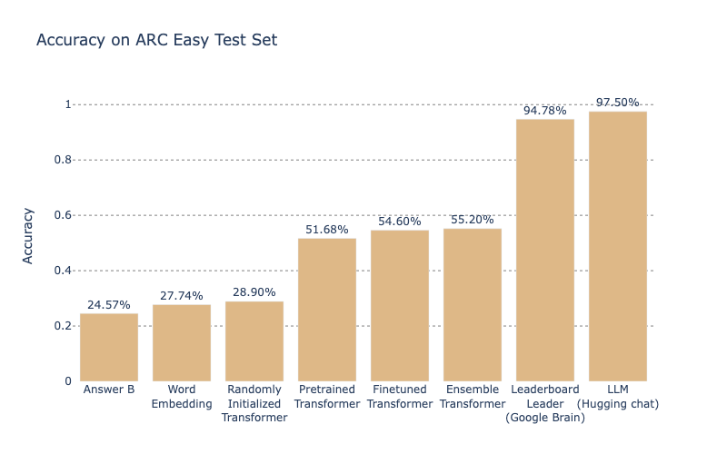

# NLP Project: AI2 Reasoning Challenge (ARC)
- Team Name: HSLU StableConfusion

## Description

This project, conducted as part of the HSLU NLP course, aims to develop solutions for the AI2 Reasoning Challenge (ARC). The challenge involves a dataset of grade-school level multiple-choice questions with the objective of achieving maximum accuracy. The project is divided into multiple tasks, including data analysis, modeling, evaluation, and error analysis.

## Tasks

- **Data Analysis**: Thorough analysis to establish a good understanding of the data.
- **Modeling**: Development of custom neural network classifiers and fine-tuning of pretrained BERT models.
- **Evaluation**: Assessment of models' performance using sample questions from the arc-easy set.
- **Error Analysis**: Investigation of model performance using saliency maps and confusion matrices.

## Dataset Details

- **Source**: Provided by the Allen Institute for AI.
- **Questions**: Grade-school level multiple-choice science questions.
- **Answers**: Each question has between 3 and 5 choices, with 99% featuring 4 choices.
- **Partitioning**: Split into 'challenge' and 'easy' levels, further divided into Train, Validation, and Test subsets.

## Models and Experiments

- **Model Types**: Custom neural network classifiers, randomly initialized BERT model, pretrained BERT model.
- **Hyperparameter Tuning**: Optimization of models with Optuna.
- **Evaluation Metrics**: Accuracy, comparison with state-of-the-art LLMs and benchmark scores.

## Results

- **Benchmark**: Initial experiment with answering all test questions with the most common answer yielded low accuracy.
- **Transformer Models**: Performances of transformer models were compared with the ARC leaderboard scores and LLMs. 
- **LLMs**: LLMs showed competitive performance, with one outperforming the current leaderboard spot. [Leaderboard](https://leaderboard.allenai.org/arc_easy/submissions/public)
- **Error Analysis**: Identified areas for improvement through saliency maps and confusion matrices.
- **Generalization**: Evaluation of finetuned models on multiple-choice datasets showed domain-specific performance differences.

## Conclusion

- **Performance**: Models performed slightly better than random guessing but worse than models on the leaderboard.
- **LLMs**: Showed competitive performance, with potential for improvement in specific question types.
- **Future Work**: Further experimentation and refinement of models to improve performance and generalization.

## Additional Information

For detailed analysis, results, and findings, please refer to the project documentation and reports.
