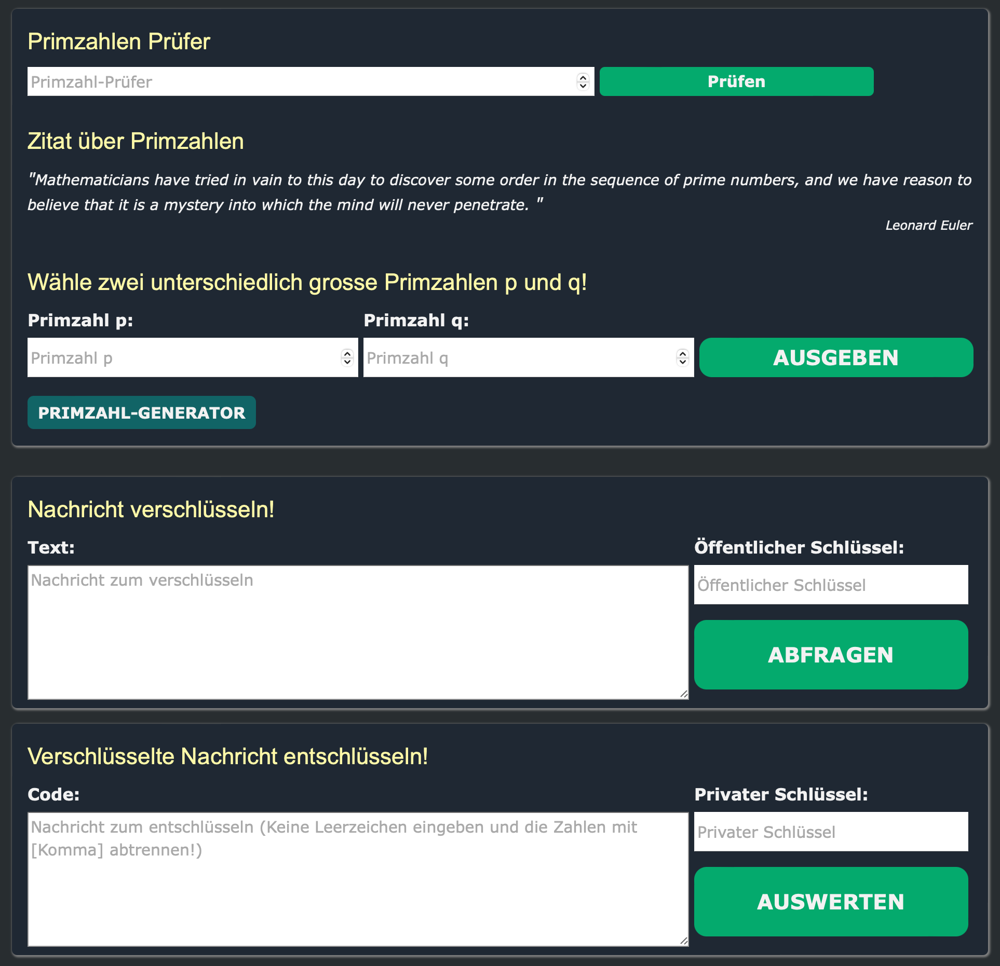

⚠️ **Important Notice:** This project is for educational purposes only and is not actively maintained. It should not be used for private or production purposes.

# RSA Encryption Website

## Introduction

The website provides an implementation of the Rivest, Shamir, Adleman (RSA) encryption algorithm. The RSA algorithm is a widely-used public-key cryptosystem for secure communication over insecure networks.

## Usage

The handling of this website is very straightforward:

1. **Key Generation**: The recipient selects two arbitrarily large prime numbers (denoted as p and q). The larger these numbers are, the more secure the encryption. The recipient keeps the private key and shares the public key with the communication partner.
   
2. **Encryption**: The communication partner encodes their message with the public key and sends it to the recipient as "ciphertext."

3. **Decryption**: Only the recipient can decrypt this "ciphertext" using their private key. If the encrypted "ciphertext" is intercepted, its content remains hidden from the attacker.

## Usage Instructions

Once you have entered the relevant information into the form, you can view your result by clicking on "OUTPUT," "QUERY," and "EVALUATE." You will be redirected to another webpage. Please note that all fields are mandatory.

Before you begin, ensure that your number is a prime number. You can check if your number is a prime by entering it into the "Prime Number Checker" field and verifying. Alternatively, you can generate random prime numbers by clicking on "PRIME NUMBER GENERATOR."

## Link to Website

[Visit the RSA Encryption Website](https://test.tsarma.ch)